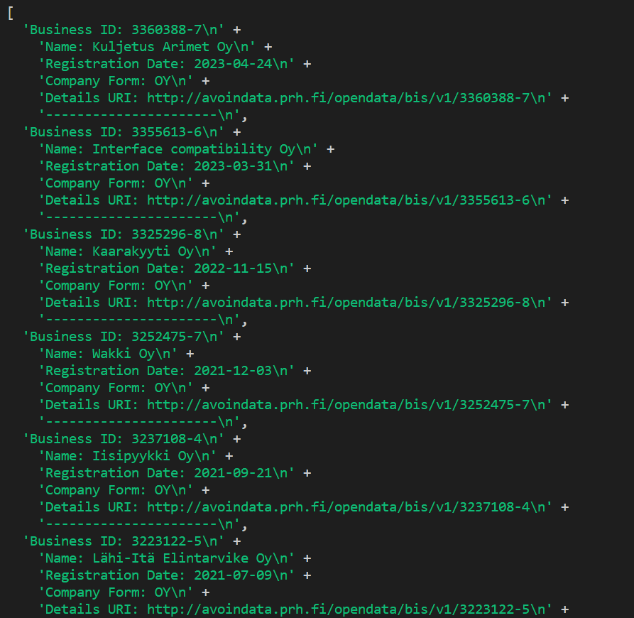

# Company portal from PRH (prh.fi)

## TypeScript Company List

This is a TypeScript application that retrieves a list of companies from the Finnish Business Information System (BIS).
## Installation
To install the application, clone this repository and install the dependencies using NPM:
````
git clone https://github.com/maya-tsedeke/fs15_6-TypeScript-prh-endpoint.git
cd fs15_6-TypeScript-prh-endpoint/src
npm install
````
Usage
Before running the application, you need to set the API endpoint for the BIS API. To do this, open index.ts and set the endpoint variable to the desired API endpoint.

To run the application, use the following command:
````
node index.js
````
Or
````
npm start
````
You will be prompted to enter values for the totalResults, streetAddressPostCode, resultsFrom, and maxResults parameters for the BIS API endpoint. Once you enter these values, the application will retrieve the list of companies and display them in the terminal as an array.
## Updated Output


## Output before comment

## License
This project is licensed under the Integrify Academy License.